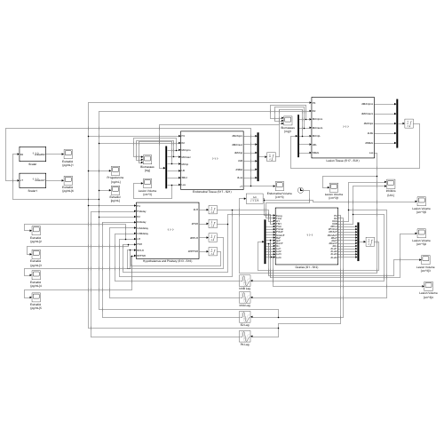

# Estradiol-Endometriosis Lesion Dynamics

This project proposes a mathematical model for the cyclic relationship between estradiol and endometriosis lesion growth. The work was completed during the 2024 MSRI-UP program at the Simons Laufer Mathematical Sciences Institute (SLMath).



## Research question

How can a dynamical-systems model represent feedback between menstrual-cycle hormones and endometriosis lesion volume, and how might estradiol suppression affect long-term lesion growth?

## Model overview

The Simulink model combines:

- A baseline menstrual-cycle model for estradiol and progesterone dynamics
- An endometrial/lesion tissue-growth model
- A hypothesized feedback term in which lesion volume contributes to estradiol production
- An exogenous estradiol-suppression factor for treatment-oriented experiments

The proposed coupling creates a feedback loop:

```text
estradiol and progesterone -> lesion growth -> additional estradiol -> lesion growth
```

The model tracks outputs including estradiol, progesterone, and lesion tissue volume over long simulation horizons.

## Main observations

The project simulations suggested that:

- Adding lesion-volume feedback to the estradiol equation increased estradiol and promoted continued lesion growth.
- Estradiol and progesterone did not change identically over long simulations, motivating further investigation of hormone imbalance and progesterone resistance.
- Introducing an exogenous estradiol-suppression term reduced simulated lesion volume.

These results are exploratory and depend on hypothesized couplings and parameters. The model is a research prototype, not a validated clinical or diagnostic tool.

## Repository structure

```text
.
├── model/
│   └── Simulator_Gomez_2021_Lesions_R2024a_Num2.slx
├── poster/
│   └── Estradiol_Endometriosis_Model_Poster.pdf
├── assets/
│   └── model_thumbnail.png
├── MODEL_NOTES.md
├── .gitignore
└── README.md
```

## Software requirements

- MATLAB R2024a or a compatible newer release
- Simulink

The supplied file was exported from R2024b to R2024a. Inspection of the model package found no external model references.

## Running the model

1. Open MATLAB.
2. Change the current folder to the repository's `model/` directory.
3. Open `Simulator_Gomez_2021_Lesions_R2024a_Num2.slx`.
4. Review the model configuration and parameters before running.
5. Run the simulation and inspect the estradiol, progesterone, and lesion-volume scopes.

The saved configuration uses the stiff solver `ode15s` and a stop time of 3,650 days. Longer simulations shown in the poster may require changing the stop time.

## Presentation

The final program presentations are hosted on the [SLMath workshop page](https://www.slmath.org/workshops/1033#videos_workshop).

## Contributors

- McKenzie L. Skrastins
- Russell J. Martinez
- Camila N. Polanco

## Acknowledgments

The poster acknowledges Dr. Candice Price, Dr. Erica Graham, Dr. Talon Johnson, Issa Susa, Amber Young, Dr. Lina Maria Gomez-Echavarria, and Dr. Jacek Kierzenka.

The work was completed in a program hosted by SLMath during summer 2024 with support acknowledged on the poster from NSF grant DMS-2149642 and Sloan grant G-2024-22394.

## Reuse and attribution

This repository includes collaborative work and a model that extends prior published models. No open-source license is assigned here. Obtain permission from the contributors and respect the terms of the underlying work before redistribution or reuse.

